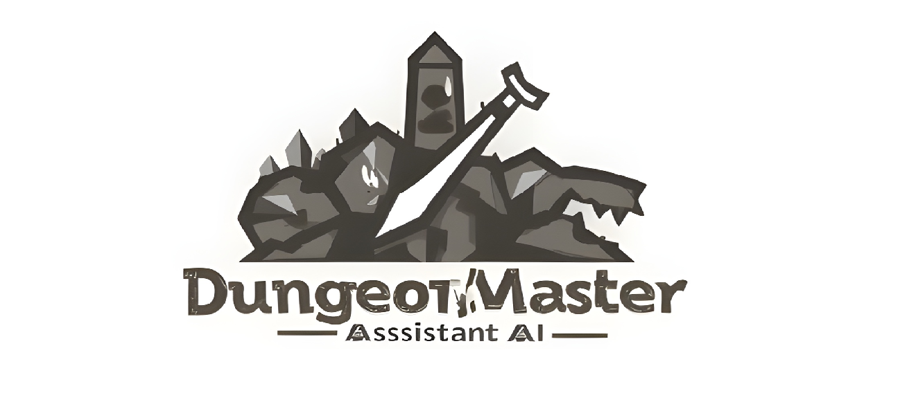

# Dungeon Master Assistant AI 🧙‍♂️🗺️



Dungeon Master Assistant AI es una herramienta poderosa diseñada para ayudar a los Dungeon Masters a crear y gestionar aventuras de Dungeons & Dragons. Utiliza inteligencia artificial para generar narrativas, actualizar estados de jugadores y del mundo, y proporcionar opciones interactivas para los jugadores.

## ✨ Características

- **Generación de Narrativas**: Crea descripciones detalladas y envolventes para tus aventuras.
- **Actualización de Estados**: Mantiene el estado del jugador y del mundo actualizado en tiempo real.
- **Interacción Dinámica**: Proporciona opciones interactivas para los jugadores basadas en el contexto de la aventura.
- **Interfaz de Usuario Intuitiva**: Fácil de usar con una interfaz gráfica amigable.

## 🛠️ Requisitos

- Python 3.7+
- Streamlit
- ChromaDB
- GoogleGenerativeAIEmbeddings
- python-dotenv

## 🚀 Instalación

1. Crea un entorno virtual y actívalo:
    ```bash
    python -m venv venv
    source venv/bin/activate  # En Windows usa `venv\Scripts\activate`
    ```

2. Instala las dependencias necesarias:
    ```bash
    pip install streamlit chromadb langchain-google-genai python-dotenv
    ```

## ⚙️ Configuración

### Archivo .env

Crea un archivo `.env` en la raíz de tu proyecto con el siguiente contenido:

```env
GOOGLE_API_KEY=your_google_api_key_here
```
Reemplaza `your_google_api_key_here` con tu clave API de Google.

### Archivo config.json

Asegúrate de tener un archivo `config.json` en la raíz de tu proyecto con el siguiente contenido:

```json
{
    "pdf_path": "data/manual.pdf",
    "persist_directory": "db"
}
```

Reemplaza `"data/manual.pdf"` con la ruta al manual en formato PDF y `"db"` con el directorio donde deseas guardar los datos persistentes.

## 🏃‍♂️ Uso

1. Ejecuta el script de configuración para generar los datos o la base de datos:
    ```bash
    python setup_chroma.py
    ```

2. Inicia la aplicación:
    ```bash
    streamlit run app.py
    ```

3. Abre tu navegador y ve a `http://localhost:8501` para interactuar con la aplicación.

## 📂 Estructura del Proyecto

| Archivo            | Descripción                                                                 |
|--------------------|-----------------------------------------------------------------------------|
| `app.py`           | Contiene la lógica de la interfaz de usuario y la interacción con el usuario.|
| `dm_logic.py`      | Contiene la lógica principal para verificar colecciones, configurar el modelo de embeddings y actualizar estados. |
| `setup_chroma.py`  | Configura el cliente de ChromaDB y carga el manual en formato PDF.           |
| `config.json`      | Archivo de configuración para rutas y directorios.                          |

## 🧩 Ejemplo de Código

```python
# Actualizar el estado del jugador
for key, value in player_updates.items():
    if key == "health":
        st.session_state.player_state[key] += value  # Cambios relativos
    elif key == "inventory":
        st.session_state.player_state[key].extend(value)  # Añadir al inventario
    else:
        st.session_state.player_state[key] = value  # Otros cambios directos

# Actualizar el estado del mundo
for key, value in world_updates.items():
    if key == "events":
        st.session_state.world_state[key].extend(value)  # Añadir eventos
    else:
        st.session_state.world_state[key] = value  # Otros cambios directos
```
## 🤝 Contribuciones

¡Las contribuciones son bienvenidas! Si deseas contribuir, por favor sigue estos pasos:

1. Haz un fork del repositorio.
2. Crea una nueva rama (`git checkout -b feature/nueva-caracteristica`).
3. Realiza tus cambios y haz commit (`git commit -am 'Añadir nueva característica'`).
4. Haz push a la rama (`git push origin feature/nueva-caracteristica`).
5. Abre un Pull Request.

## 📜 Licencia

Este proyecto está licenciado bajo la Licencia MIT. Consulta el archivo [LICENSE](LICENSE) para más detalles.

---
